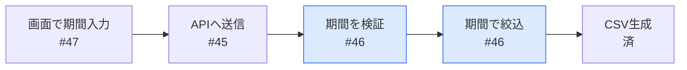
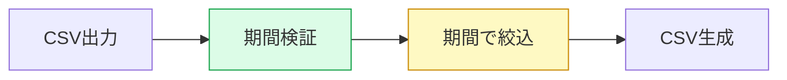

## 何のため
経理が月次締めで前月分だけCSV出力したい。Part of #123

## 全体のどこか

## このPRですること
`exportCsv` に期間の絞り込みを追加。画面側は #47 で対応。

## 見てほしい所
- `export.ts:42` 終了日なしのとき今日までにしている扱い
- タイムゾーンはJST固定（#123 Q1 の回答どおり）

## テスト
| 例 | テスト |
|---|---|
| 8/1〜8/31 | ✅ |
| 終了日なし | ✅ |
| 開始>終了 | ✅ |

メモとの差分・AIレビュー結果

**メモにない判断**: エラーは400で返す（既存APIに合わせた）
**指摘**: warn 2件 / info 5件

