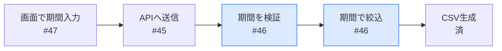
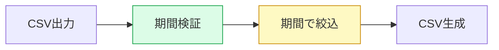

# PR のテンプレート

## タイトル

```
feat(order-api): 期間指定でCSVを絞り込む [2/3] #123
```

`type(scope): 利用者から見た変化 [k/n] #Issue番号`。`orch lint pr --title` が形式を検査する。

## 本文

````markdown
## 何のため
経理が月次締めで前月分だけCSV出力したい。Part of #123

## 全体のどこか


## このPRですること
`exportCsv` に期間の絞り込みを追加。画面側は #47 で対応。



## 見てほしい所
- `export.ts:42` 終了日なしのとき今日までにしている扱い
- タイムゾーンはJST固定（#123 Q1 の回答どおり）

## テスト
| 例 | テスト |
|---|---|
| 8/1〜8/31 | ✅ |
| 終了日なし | ✅ |
| 開始>終了 | ✅ |

<details><summary>メモとの差分・AIレビュー結果</summary>

**メモにない判断**: エラーは400で返す（既存APIに合わせた）
**指摘**: warn 2件 / info 5件 …
</details>
````

## ルール（`orch lint pr` が検査する）

| 項目 | 上限 |
|---|---|
| 本文全体 | 60行以内 |
| 折りたたみを除く本体 | 30行以内 |
| 図 | ちょうど2枚 |
| 1図のノード | 8個まで |
| 見てほしい所 | 3つまで |

- 図は「全体のどこか」→「変更前後」の順。大きい話から細部へ
- 「全体のどこか」は理解メモの図を使い回し、色を塗る位置だけ変える
- 「変更前後」はこのPRで作る。**新規=緑、変更=黄、変更なし=色なし**
- ノードは処理の名前で書く。ファイル名・関数名は書かない
- 「見てほしい所」に出すのは、メモにない判断 / warnが出た箇所 / 重要パスの3種類
- テストの表は理解メモの例と1対1。食い違いは `orch-memo-check` が検出する
- 途中のPRは `Part of #123`、最後だけ `Closes #123`
- 別リポジトリのIssueは自動クローズされないので、マージ後にスクリプトで閉じる
- warn / info も捨てず、折りたたみに全件記載する（除外せず、並べるだけ）

## スタック

2本目以降は前のPRのブランチを base にして並行で出す。

```
#45 (main ← orch/45)
 └ #46 (orch/45 ← orch/46)   ← [2/3]
    └ #47 (orch/46 ← orch/47)
```

前のPRがマージされて head ブランチが消えると、GitHub が次のPRの base を自動で main に切り替える。
このとき SHA は変わらないので、承認もそのまま維持される。
