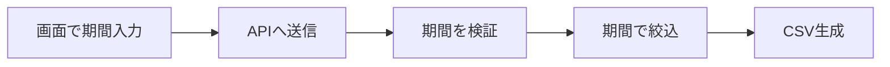

# 理解メモのテンプレート

そのまま貼れる完成形。上限は `orch lint memo` が機械的に検査する。

````markdown
<!-- ai-memo v1 -->
## 理解メモ
**やること**: 管理画面CSVに期間フィルタを追加
> なぜ: 経理が月次締めで前月分だけ出力したい
> 現状: 全期間が出て手作業で削っている
> 範囲: 管理画面の注文CSVのみ

**対象**: `admin-web`, `order-api`

| 例 | 結果 |
|---|---|
| 8/1〜8/31 | 8月分のみ |
| 終了日なし | 今日まで |
| 開始>終了 | エラー表示 |

**確認事項** @起票者
- [x] Q1 日付の基準は？ (A)JST (B)UTC → **A** (9/12回答)
- [ ] Q2 上限期間は？ (A)なし (B)1年

**仮定（違えば指摘）**: 既存APIにfrom/toを追加



<details><summary>スケルトン</summary>

```ts
// order-api
type ExportRange = { from: Date; to?: Date }
test("8/1〜8/31 → 8月分のみ")
test("終了日なし → 今日まで")
// admin-web
test("開始>終了 → エラー表示")
```
</details>

---
<sub>🚀 着手OK ／ 🎉 後回し
作り直し: 👎 理解がズレ ／ 😕 例が違う ／ 👀 長い（読むのが大変）</sub>
````

## 各ブロックの決まり

| ブロック | 決まり |
|---|---|
| やること | 1行。利用者から見た変化で書く |
| なぜ・現状・範囲 | 引用で3行固定。増やさない |
| 対象 | 変更するリポジトリ・パッケージ名 |
| 例 | 最大5行。入力と結果の組。ここがそのままテストになる |
| 確認事項 | 最大3つ。**必ず選択肢を付ける**。答えによって例が変わるものだけ |
| 仮定 | 内部実装だけ変わるもの。違えば指摘してもらう前提で書く |
| 図 | 1枚だけ。処理の名前で書き、ファイル名・関数名は書かない。PR本文で使い回す |
| スケルトン | 20行以内。テスト名は例の表と1対1 |

## 回答の反映（memo-update）

- 回答済みの確認事項は `- [x] ... → **A** (9/12回答)` の形にして残す
- 回答で例が変わるなら例の表も直す
- 同じコメントを上書きする（`--update`）。新規投稿しない
